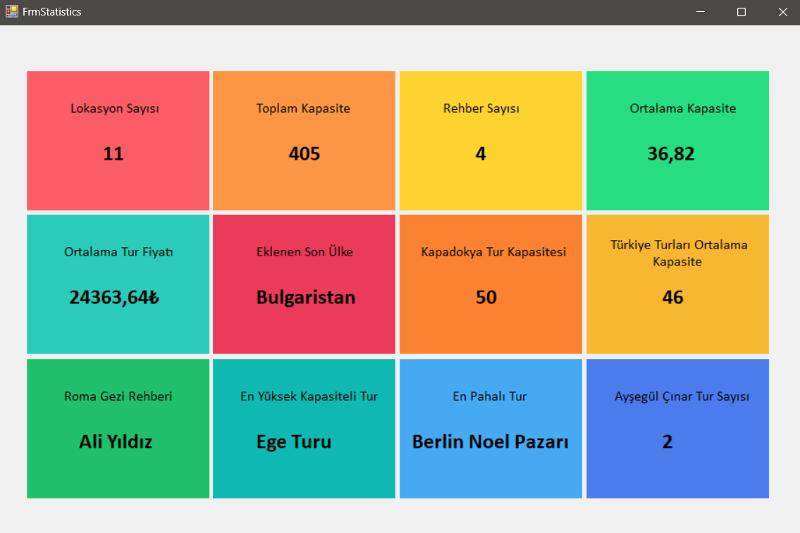

# C# Eğitim Kampı 301. Ders: Nesne Yönelimli Programlama (OOP) ve N Katmanlı Mimari

Bu bölümde, Nesne Yönelimli Programlama (OOP) prensipleri ve N Katmanlı Mimari'nin Entity Katmanı ele alınmıştır.

## İçerik

- **Nesne Yönelimli Programlama (OOP):**
  - Sınıflar ve Nesneler
  - Kapsülleme
  - Kalıtım
  - Çok Biçimlilik
  - Soyutlama

- **N Katmanlı Mimari:**
  - Entity Katmanı Nedir?
  - Entity Katmanı'nın Görevleri
  - Entity Katmanı'nın Avantajları

## OOP Prensipleri

**Sınıflar ve Nesneler:** Sınıflar, nesnelerin kalıplarıdır ve nesneler bu sınıflardan türetilir.

**Kapsülleme:** Veri ve işlevlerin bir arada tutulması ve dışarıya karşı gizlenmesidir.

**Kalıtım:** Bir sınıfın başka bir sınıftan özellik ve metotları miras almasıdır.

**Çok Biçimlilik:** Aynı işlemin farklı şekillerde uygulanabilmesidir.

**Soyutlama:** Gereksiz detayların gizlenerek sadece gerekli bilgilerin öne çıkarılmasıdır.

## N Katmanlı Mimari ve Entity Katmanı

**Entity Katmanı:** Uygulamanın veri modellerini içerir ve veritabanı ile uygulama arasındaki veri alışverişini sağlar.

**Görevleri:**

- Veri Temsili
- Bağımsızlık
- Veri Doğrulama

**Avantajları:**

- Yeniden Kullanılabilirlik
- Sadelik
- Bağımsızlık

## Kaynaklar

- [C# Eğitim Kampı - YouTube Oynatma Listesi](https://www.youtube.com/playlist?list=PLKnjBHu2xXNPmFMvGKVHA_ijjrgUyNIXr)

## Case 3 

